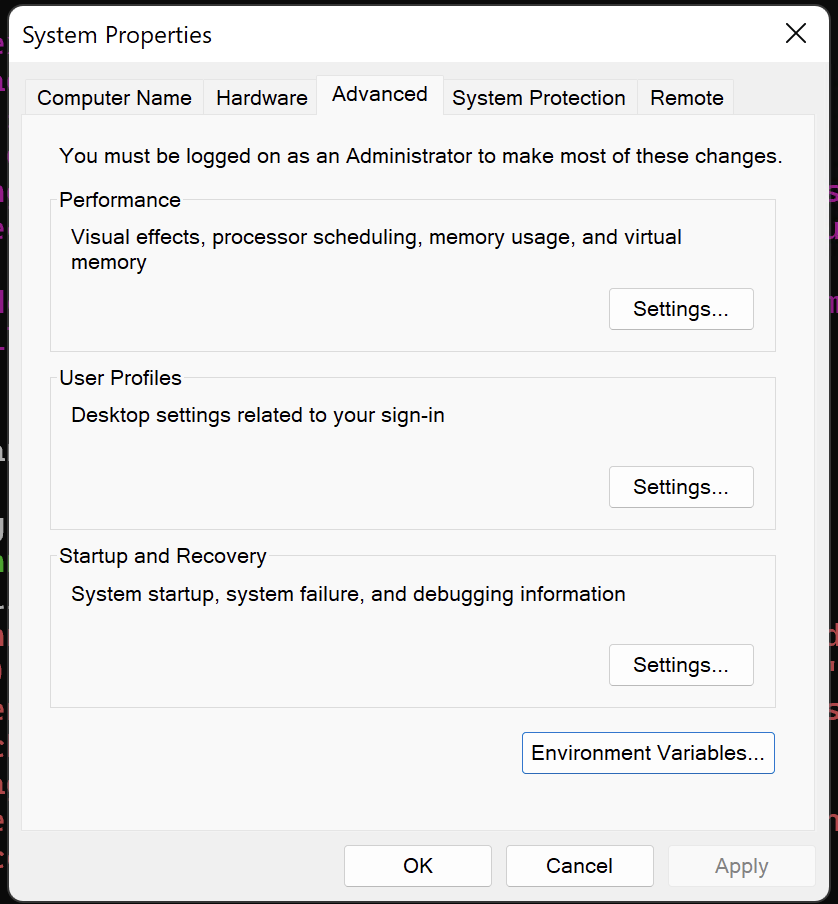
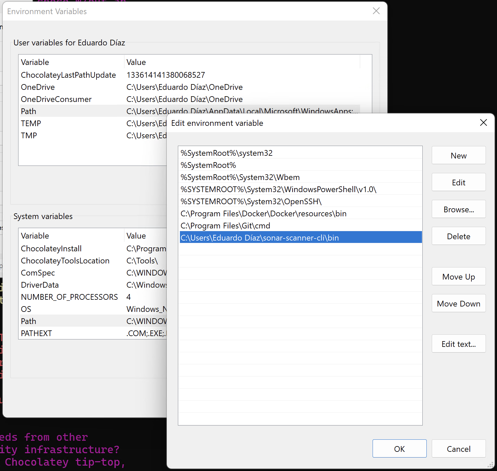
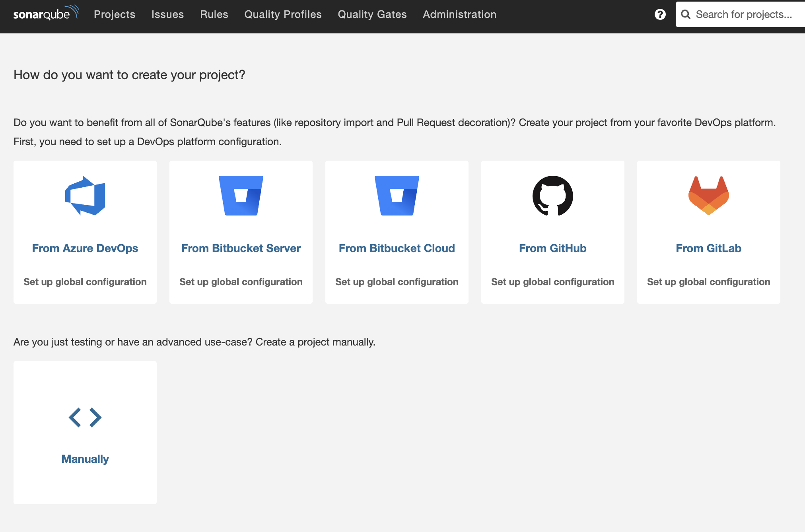
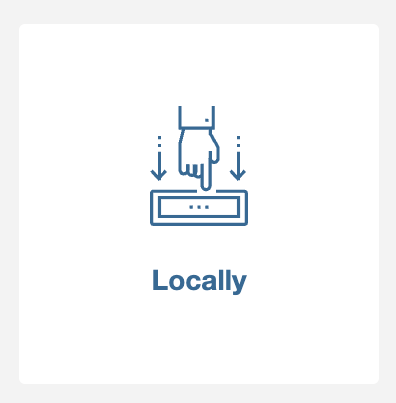
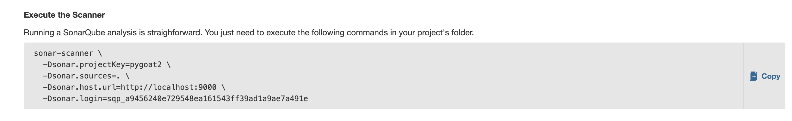
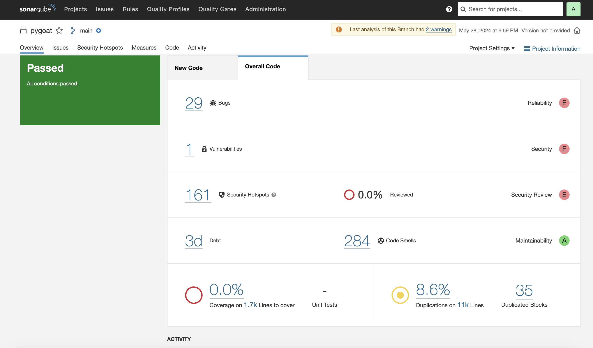

# Laboratorio Sonarqube

Necesitas tener instalado docker y java.

## Instala Sonarqube

Ejecuta:

        docker-compose up -d --build

Ingresa a la dirección http://localhost:9000/ usando los valores default de Sonarqube:

        Usuario: admin
        Password: admin

Inmediatamente se te pedirá cambiar la password.

## Instala SonarScanner

Descarga la versión para tu Sistema Operativo acá: https://docs.sonarsource.com/sonarqube/latest/analyzing-source-code/scanners/sonarscanner/

### Windows

En windows descargas un archivo .zip, descomprimelo en una carpeta y debes agregar en %PATH% la sub carpeta `bin` de la carpeta donde descomprimiste el .zip. 

Para configurar esta variable abre las systems properties::

Luego selecciona el botón "Environmen Variables" (o "Variables de Entorno"), se abre una nueva ventana con todas las variables, busca 'Path' y agrega la carpeta (en este caso es "C:\Users\Eduardo Díaz\sonar-scanner-cli\bin", en mi caso he descomprimido el .zip en "C:\Users\Eduardo Díaz\sonar-scanner-cli").

### MacOs

Si usas MacOs y tienes intalado `brew` ejecuta:

        brew install sonar-scanner

## Crea un proyecto

En la pantalla inicial de Sonarqube selecciona `Manually`:

Ingresa `pygoat` en `Project Name` y el `Project Key` en el formulario que aparece.

Luego presiona el botón `Locally`:

Cuando aparezca `Provide Token` presiona el botón `Generate`.

Luego te muestra una pantalla con el token, presiona `continue`.

Debajo de la pregunta que dice **What option best describes your build?** presiona `Other (for JS, TS, Go, Python, PHP...)`.

Luego selecciona tu sistema operativo.

Te aparecerá unas instrucciones parecidas a esta:

Presiona el botón `+ Copy` y ejecuta el comando en la consola bajo la carpeta `pygoat` de este repositorio.

Ejemplo:

        % cd pygoat
        % sonar-scanner \
              -Dsonar.projectKey=pygoat2 \
              -Dsonar.sources=. \
              -Dsonar.host.url=http://localhost:9000 \
              -Dsonar.login=sqp_a9456240e729548ea161543ff39ad1a9ae7a491e

Luego de que termine de ejecutar vuelve al sitio de Sonarqube y verás una página como esta:

